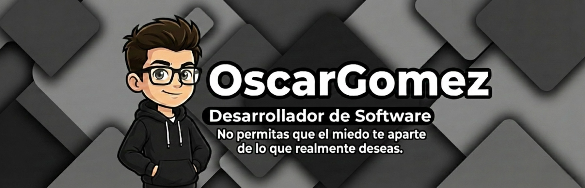

<!-- =======================
     Presentación principal
======================== -->

<h1>Hola, soy Oscar 👋</h1>
<h3>Bienvenido a mi perfil</h3>

<!-- =======================
     Banner personal 
======================== -->

  

  <h2>Sobre mí</h2>

Aprendiz en desarrollo de software, con mayor afinidad por el desarrollo backend y la construcción de lógica de negocio.  
Cuento con conocimientos en frontend, lo que me permite comprender el flujo completo de una aplicación y facilitar la integración entre capas.  
Me caracterizo por la responsabilidad, la actitud proactiva y el aprendizaje continuo.

---

  <h2>Mi Stack Tecnológico</h2>

  
  
  
  
  
  
  
  

  <h2>Contáctame</h2>

&nbsp;&nbsp;&nbsp;

